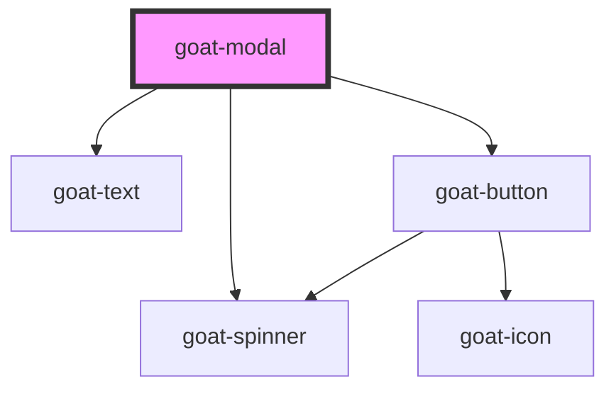

# p4-modal

<!-- Auto Generated Below -->

## Properties

| Property     | Attribute     | Description                                                  | Type                   | Default     |
| ------------ | ------------- | ------------------------------------------------------------ | ---------------------- | ----------- |
| `heading`    | `heading`     |                                                              | `string`               | `undefined` |
| `hideClose`  | `hide-close`  |                                                              | `boolean`              | `false`     |
| `managed`    | `managed`     | Specify whether the Modal is managed by the parent component | `boolean`              | `false`     |
| `open`       | `open`        | Specify whether the Modal is currently open                  | `boolean`              | `false`     |
| `showLoader` | `show-loader` |                                                              | `boolean`              | `false`     |
| `size`       | `size`        |                                                              | `"lg" \| "md" \| "sm"` | `'md'`      |
| `subheading` | `subheading`  |                                                              | `string`               | `undefined` |

## Events

| Event               | Description                                                              | Type               |
| ------------------- | ------------------------------------------------------------------------ | ------------------ |
| `goat-modal--close` | On click of button, a CustomEvent 'goat-modal--close' will be triggered. | `CustomEvent<any>` |

## Dependencies

### Depends on

- [goat-text](../../typography/text)
- [goat-button](../../button/button)
- [goat-spinner](../../spinner)

### Graph

----------------------------------------------

*Built with love!*
