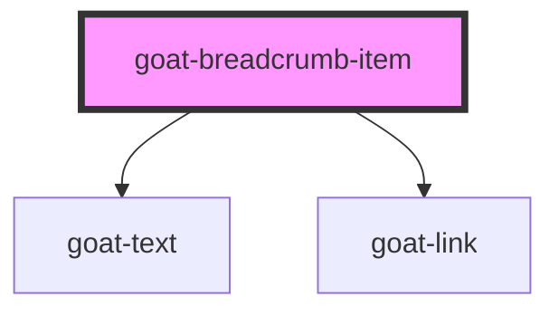

# goat-tab

<!-- Auto Generated Below -->

## Properties

| Property   | Attribute  | Description                                                       | Type      | Default     |
| ---------- | ---------- | ----------------------------------------------------------------- | --------- | ----------- |
| `active`   | `active`   |                                                                   | `boolean` | `false`     |
| `href`     | `href`     | Hyperlink to navigate to on click.                                | `string`  | `undefined` |
| `position` | `position` |                                                                   | `string`  | `undefined` |
| `target`   | `target`   | Sets or retrieves the window or frame at which to target content. | `string`  | `undefined` |

## Dependencies

### Depends on

- [goat-text](../../../primitive/typography/text)
- [goat-link](../../../primitive/link)

### Graph

----------------------------------------------

*Built with love!*
