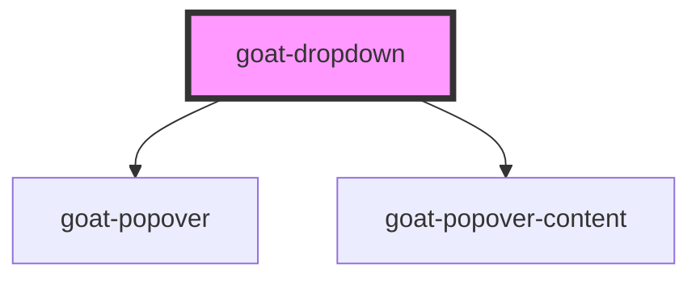

# goat-dropdown

<!-- Auto Generated Below -->

## Properties

| Property     | Attribute    | Description                                                                       | Type                             | Default                                       |
| ------------ | ------------ | --------------------------------------------------------------------------------- | -------------------------------- | --------------------------------------------- |
| `disabled`   | `disabled`   | If true, the user cannot interact with the button. Defaults to `false`.           | `boolean`                        | `false`                                       |
| `managed`    | `managed`    |                                                                                   | `boolean`                        | `false`                                       |
| `open`       | `open`       |                                                                                   | `boolean`                        | `false`                                       |
| `placements` | `placements` |                                                                                   | `string`                         | `'bottom-start,top-start,bottom-end,top-end'` |
| `size`       | `size`       | The button size. Possible values are: `"sm"`, `"md"`, `"lg"`. Defaults to `"md"`. | `"lg" \| "md" \| "sm"`           | `'md'`                                        |
| `trigger`    | `trigger`    |                                                                                   | `"click" \| "hover" \| "manual"` | `'click'`                                     |

## Events

| Event                       | Description | Type               |
| --------------------------- | ----------- | ------------------ |
| `goat-dropdown--item-click` |             | `CustomEvent<any>` |

## Methods

### `setFocus() => Promise<void>`

#### Returns

Type: `Promise<void>`

## Dependencies

### Depends on

- [goat-popover](../../../informational/popover/popover)
- [goat-popover-content](../../../informational/popover/popover-content)

### Graph

----------------------------------------------

*Built with love!*
