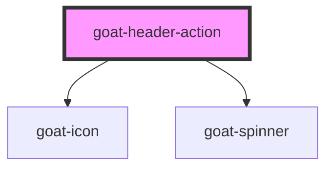

# p4-top-navigation

<!-- Auto Generated Below -->

## Properties

| Property         | Attribute         | Description                                                                    | Type      | Default     |
| ---------------- | ----------------- | ------------------------------------------------------------------------------ | --------- | ----------- |
| `configAria`     | `config-aria`     |                                                                                | `any`     | `{}`        |
| `disabled`       | `disabled`        | If true, the user cannot interact with the button. Defaults to `false`.        | `boolean` | `false`     |
| `disabledReason` | `disabled-reason` |                                                                                | `string`  | `''`        |
| `href`           | `href`            | Hyperlink to navigate to on click.                                             | `string`  | `undefined` |
| `icon`           | `icon`            | Icon which will displayed on button. Possible values are bootstrap icon names. | `string`  | `undefined` |
| `iconEnd`        | `icon-end`        | Icon position.                                                                 | `boolean` | `false`     |
| `selected`       | `selected`        | Button selection state.                                                        | `boolean` | `false`     |
| `showLoader`     | `show-loader`     | Show loader.                                                                   | `boolean` | `false`     |
| `target`         | `target`          | Sets or retrieves the window or frame at which to target content.              | `string`  | `'_self'`   |

## Events

| Event        | Description                                                       | Type               |
| ------------ | ----------------------------------------------------------------- | ------------------ |
| `goat:click` | On click of button, a CustomEvent 'goat:click' will be triggered. | `CustomEvent<any>` |

## Methods

### `triggerClick() => Promise<void>`

#### Returns

Type: `Promise<void>`

## Dependencies

### Depends on

- [goat-icon](../../content/icon)
- [goat-spinner](../../content/spinner)

### Graph

----------------------------------------------

*Built with love!*
