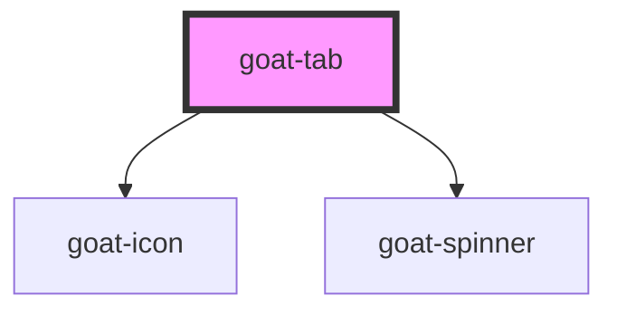

# goat-button

<!-- Auto Generated Below -->

## Properties

| Property         | Attribute         | Description                                                                                   | Type                                               | Default     |
| ---------------- | ----------------- | --------------------------------------------------------------------------------------------- | -------------------------------------------------- | ----------- |
| `block`          | `block`           | If true, fits button width to its parent width. Defaults to `false`.                          | `boolean`                                          | `false`     |
| `color`          | `color`           | Color variants.                                                                               | `"error" \| "primary" \| "secondary" \| "success"` | `'primary'` |
| `configAria`     | `config-aria`     |                                                                                               | `any`                                              | `{}`        |
| `disabled`       | `disabled`        | If true, the user cannot interact with the button. Defaults to `false`.                       | `boolean`                                          | `false`     |
| `disabledReason` | `disabled-reason` |                                                                                               | `string`                                           | `''`        |
| `icon`           | `icon`            | Icon which will displayed on button. Possible values are bootstrap icon names.                | `string`                                           | `undefined` |
| `iconEnd`        | `icon-end`        | Icon position.                                                                                | `boolean`                                          | `false`     |
| `selected`       | `selected`        | Button selection state.                                                                       | `boolean`                                          | `false`     |
| `showLoader`     | `show-loader`     | Show loader.                                                                                  | `boolean`                                          | `false`     |
| `size`           | `size`            | Button size. Possible values are `"sm"`, `"md"`, `"lg"`, `"xl"`, `"xxl"`. Defaults to `"md"`. | `"lg" \| "md" \| "sm" \| "xl" \| "xxl"`            | `'md'`      |

## Events

| Event        | Description                                                       | Type               |
| ------------ | ----------------------------------------------------------------- | ------------------ |
| `goat:click` | On click of button, a CustomEvent 'goat:click' will be triggered. | `CustomEvent<any>` |

## Methods

### `triggerClick() => Promise<void>`

#### Returns

Type: `Promise<void>`

## Dependencies

### Depends on

- [goat-icon](../../content/icon)
- [goat-spinner](../../content/spinner)

### Graph

----------------------------------------------

*Built with love!*
