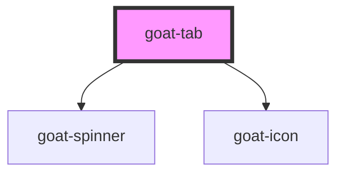

# goat-tab

<!-- Auto Generated Below -->

## Properties

| Property         | Attribute         | Description                                                                    | Type                                             | Default     |
| ---------------- | ----------------- | ------------------------------------------------------------------------------ | ------------------------------------------------ | ----------- |
| `disabled`       | `disabled`        | If true, the user cannot interact with the button. Defaults to `false`.        | `boolean`                                        | `false`     |
| `disabledReason` | `disabled-reason` |                                                                                | `string`                                         | `''`        |
| `href`           | `href`            | Hyperlink to navigate to on click.                                             | `string`                                         | `undefined` |
| `icon`           | `icon`            | Icon which will displayed on button. Possible values are bootstrap icon names. | `string`                                         | `undefined` |
| `label`          | `label`           |                                                                                | `string`                                         | `undefined` |
| `selected`       | `selected`        | Button selection state.                                                        | `boolean`                                        | `false`     |
| `showLoader`     | `show-loader`     | Show loader.                                                                   | `boolean`                                        | `false`     |
| `target`         | `target`          |                                                                                | `string`                                         | `undefined` |
| `type`           | `type`            |                                                                                | `"contained" \| "contained-bottom" \| "default"` | `'default'` |
| `value`          | `value`           |                                                                                | `string`                                         | `undefined` |

## Events

| Event            | Description                                                        | Type               |
| ---------------- | ------------------------------------------------------------------ | ------------------ |
| `goat:tab-click` | On click of tab, a CustomEvent 'goat:tab-click' will be triggered. | `CustomEvent<any>` |

## Methods

### `setFocus() => Promise<void>`

#### Returns

Type: `Promise<void>`

### `triggerClick() => Promise<void>`

#### Returns

Type: `Promise<void>`

## Dependencies

### Depends on

- [goat-spinner](../../../informational/spinner)
- [goat-icon](../../../primitive/icon)

### Graph

----------------------------------------------

*Built with love!*
