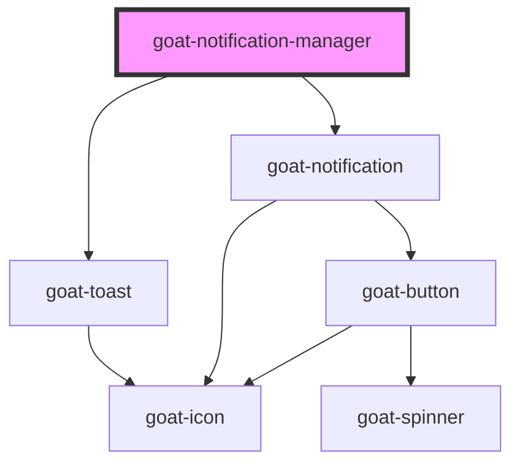

# goat-alert

<!-- Auto Generated Below -->

## Properties

| Property   | Attribute  | Description | Type                                                           | Default          |
| ---------- | ---------- | ----------- | -------------------------------------------------------------- | ---------------- |
| `name`     | `name`     |             | `string`                                                       | `'global'`       |
| `position` | `position` |             | `"bottom-left" \| "bottom-right" \| "top-left" \| "top-right"` | `'bottom-right'` |

## Dependencies

### Depends on

- [goat-toast](../toast)
- [goat-notification](../notification)

### Graph

----------------------------------------------

*Built with love!*
