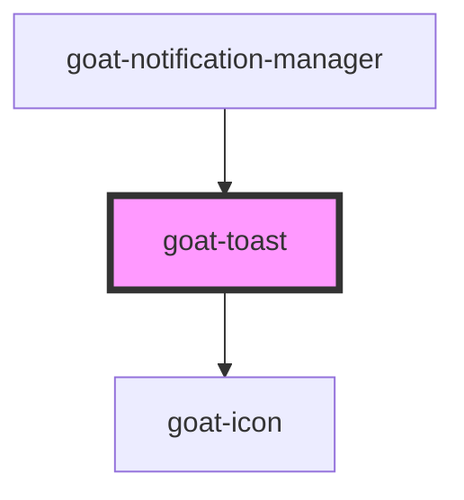

# goat-alert

<!-- Auto Generated Below -->

## Properties

| Property  | Attribute | Description | Type                                          | Default  |
| --------- | --------- | ----------- | --------------------------------------------- | -------- |
| `message` | `message` |             | `string`                                      | `''`     |
| `state`   | `state`   |             | `"error" \| "info" \| "success" \| "warning"` | `'info'` |

## Dependencies

### Used by

 - [goat-notification-manager](../../../feedback/notification-manager)

### Depends on

- [goat-icon](../../../general/icon)

### Graph

----------------------------------------------

*Built with love!*
