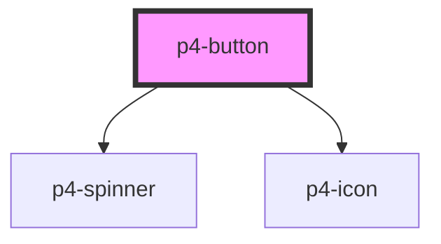

# p4-button

<!-- Auto Generated Below -->

## Properties

| Property     | Attribute     | Description                                                                                                              | Type                                                       | Default     |
| ------------ | ------------- | ------------------------------------------------------------------------------------------------------------------------ | ---------------------------------------------------------- | ----------- |
| `block`      | `block`       | If true, fits button width to its parent width. Defaults to `false`.                                                     | `boolean`                                                  | `false`     |
| `disabled`   | `disabled`    | If true, the user cannot interact with the button. Defaults to `false`.                                                  | `boolean`                                                  | `false`     |
| `icon`       | `icon`        |                                                                                                                          | `string`                                                   | `undefined` |
| `showLoader` | `show-loader` |                                                                                                                          | `boolean`                                                  | `false`     |
| `size`       | `size`        | Button size. Possible values are `"sm"`, `"md"`, `"lg"`. Defaults to `"md"`.                                             | `"lg" \| "md" \| "sm"`                                     | `'md'`      |
| `variant`    | `variant`     | Button variants Possible values are `"default"`, `"primary"`, `"dashed"`, `"danger"`, `"link"`. Defaults to `"default"`. | `"danger" \| "dashed" \| "default" \| "link" \| "primary"` | `'default'` |

## Events

| Event     | Description                                                   | Type               |
| --------- | ------------------------------------------------------------- | ------------------ |
| `p4Click` | On click of button a CustomEvent 'p4Click' will be triggered. | `CustomEvent<any>` |

## Dependencies

### Depends on

- [p4-spinner](../p4-spinner)
- [p4-icon](../p4-icon)

### Graph

----------------------------------------------

*Built with love!*
