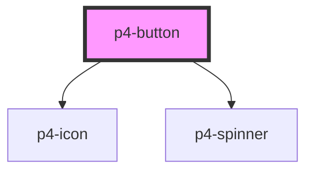

# p4-button

<!-- Auto Generated Below -->

## Properties

| Property       | Attribute       | Description                                                                                                                       | Type                                                               | Default     |
| -------------- | --------------- | --------------------------------------------------------------------------------------------------------------------------------- | ------------------------------------------------------------------ | ----------- |
| `block`        | `block`         | If true, fits button width to its parent width. Defaults to `false`.                                                              | `boolean`                                                          | `false`     |
| `disabled`     | `disabled`      | If true, the user cannot interact with the button. Defaults to `false`.                                                           | `boolean`                                                          | `false`     |
| `href`         | `href`          |                                                                                                                                   | `string`                                                           | `undefined` |
| `icon`         | `icon`          | Icon which will displayed on button. Possible values are bootstrap icon names.                                                    | `string`                                                           | `undefined` |
| `iconPosition` | `icon-position` | Icon position. Possible values are `"left"`, `"right"`. Defaults to `"left"`.                                                     | `"left" \| "right"`                                                | `'left'`    |
| `showLoader`   | `show-loader`   |                                                                                                                                   | `boolean`                                                          | `false`     |
| `size`         | `size`          | Button size. Possible values are `"sm"`, `"md"`, `"lg"`. Defaults to `"md"`.                                                      | `"lg" \| "md" \| "sm"`                                             | `'md'`      |
| `target`       | `target`        |                                                                                                                                   | `"_blank" \| "_self"`                                              | `'_self'`   |
| `variant`      | `variant`       | Button variants. Possible values are `"primary"`, `"secondary"`, `"ghost-primary"`, `"ghost-secondary"`. Defaults to `"primary"`. | `"ghost-primary" \| "ghost-secondary" \| "primary" \| "secondary"` | `'primary'` |

## Events

| Event     | Description                                                   | Type               |
| --------- | ------------------------------------------------------------- | ------------------ |
| `p4Click` | On click of button a CustomEvent 'p4Click' will be triggered. | `CustomEvent<any>` |

## Dependencies

### Depends on

- [p4-icon](../p4-icon)
- [p4-spinner](../p4-spinner)

### Graph

----------------------------------------------

*Built with love!*
