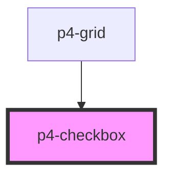

# p4-checkbox

<!-- Auto Generated Below -->

## Properties

| Property   | Attribute  | Description                                                                           | Type                    | Default     |
| ---------- | ---------- | ------------------------------------------------------------------------------------- | ----------------------- | ----------- |
| `disabled` | `disabled` | If true, the user cannot interact with the button. Defaults to `false`.               | `boolean`               | `false`     |
| `label`    | `label`    | The checkbox label.                                                                   | `string`                | `undefined` |
| `required` | `required` | If true, required icon is show. Defaults to `false`.                                  | `boolean`               | `false`     |
| `size`     | `size`     | The button size. Possible values are: `"sm"`, `"md"`, `"lg"`. Defaults to `"md"`.     | `"lg" \| "md" \| "sm"`  | `'md'`      |
| `value`    | `value`    | The input field value.                                                                | `boolean`               | `false`     |
| `variant`  | `variant`  | Button variants Possible values are `"default"`, `"dashed"`. Defaults to `"default"`. | `"dashed" \| "default"` | `'default'` |

## Events

| Event      | Description                                                                                                                      | Type               |
| ---------- | -------------------------------------------------------------------------------------------------------------------------------- | ------------------ |
| `p4Change` | On change of input a CustomEvent 'p4Change' will be triggered. Event details contains parent event, oldValue, newValue of input. | `CustomEvent<any>` |

## Dependencies

### Used by

 - [p4-grid](../p4-grid)

### Graph

----------------------------------------------

*Built with love!*
