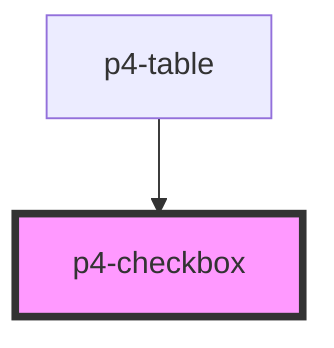

# p4-checkbox

<!-- Auto Generated Below -->

## Properties

| Property   | Attribute  | Description                                                                       | Type                   | Default     |
| ---------- | ---------- | --------------------------------------------------------------------------------- | ---------------------- | ----------- |
| `disabled` | `disabled` | If true, the user cannot interact with the button. Defaults to `false`.           | `boolean`              | `false`     |
| `label`    | `label`    | The checkbox label.                                                               | `string`               | `undefined` |
| `required` | `required` | If true, required icon is show. Defaults to `false`.                              | `boolean`              | `false`     |
| `size`     | `size`     | The button size. Possible values are: `"sm"`, `"md"`, `"lg"`. Defaults to `"md"`. | `"lg" \| "md" \| "sm"` | `'md'`      |
| `value`    | `value`    | The input field value.                                                            | `boolean`              | `false`     |

## Events

| Event       | Description                                                                                                                       | Type               |
| ----------- | --------------------------------------------------------------------------------------------------------------------------------- | ------------------ |
| `p4:blur`   | Emitted when the input loses focus.                                                                                               | `CustomEvent<any>` |
| `p4:change` | On change of input a CustomEvent 'p4:change' will be triggered. Event details contains parent event, oldValue, newValue of input. | `CustomEvent<any>` |
| `p4:focus`  | Emitted when the input has focus.                                                                                                 | `CustomEvent<any>` |

## Methods

### `setBlur() => Promise<void>`

Sets blur on the native `input` in `p4-input`. Use this method instead of the global
`input.blur()`.

#### Returns

Type: `Promise<void>`

### `setFocus() => Promise<void>`

Sets focus on the native `input` in `p4-input`. Use this method instead of the global
`input.focus()`.

#### Returns

Type: `Promise<void>`

## Dependencies

### Used by

 - [p4-table](../p4-table)

### Graph

----------------------------------------------

*Built with love!*
