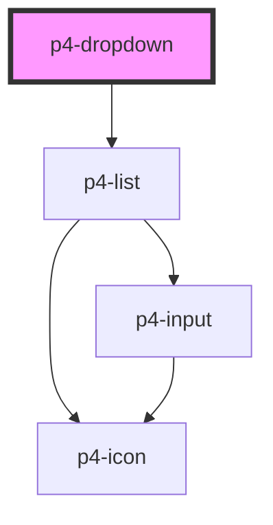

# p4-dropdown

<!-- Auto Generated Below -->

## Properties

| Property       | Attribute       | Description                                                                       | Type                                                           | Default         |
| -------------- | --------------- | --------------------------------------------------------------------------------- | -------------------------------------------------------------- | --------------- |
| `data`         | --              |                                                                                   | `any[]`                                                        | `[]`            |
| `disabled`     | `disabled`      | If true, the user cannot interact with the button. Defaults to `false`.           | `boolean`                                                      | `false`         |
| `enableSearch` | `enable-search` |                                                                                   | `boolean`                                                      | `false`         |
| `isOpen`       | `is-open`       |                                                                                   | `boolean`                                                      | `false`         |
| `itemVariant`  | `item-variant`  |                                                                                   | `any`                                                          | `'default'`     |
| `listVariant`  | `list-variant`  |                                                                                   | `any`                                                          | `'default'`     |
| `position`     | `position`      |                                                                                   | `"bottom-left" \| "bottom-right" \| "top-left" \| "top-right"` | `'bottom-left'` |
| `showLoader`   | `show-loader`   |                                                                                   | `boolean`                                                      | `false`         |
| `size`         | `size`          | The button size. Possible values are: `"sm"`, `"md"`, `"lg"`. Defaults to `"md"`. | `"lg" \| "md" \| "sm"`                                         | `'md'`          |

## Events

| Event                    | Description                       | Type               |
| ------------------------ | --------------------------------- | ------------------ |
| `p4:dropdown-item-click` | Emitted when the item is clicked. | `CustomEvent<any>` |

## Methods

### `setFocus() => Promise<void>`

#### Returns

Type: `Promise<void>`

## Dependencies

### Depends on

- [p4-list](../p4-list)

### Graph

----------------------------------------------

*Built with love!*
