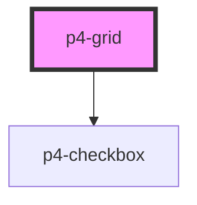

# p4-grid

<!-- Auto Generated Below -->

## Properties

| Property        | Attribute        | Description                                                                                                                                                                                                                                                         | Type         | Default     |
| --------------- | ---------------- | ------------------------------------------------------------------------------------------------------------------------------------------------------------------------------------------------------------------------------------------------------------------- | ------------ | ----------- |
| `columnConfig`  | --               | Grid columns configuration. [{"name":"name","label":"Name","width":300,"fixed":true},{"name":"age","label":"Age"},{"name":"eyeColor","label":"Eye Color","width":500}].                                                                                             | `any[]`      | `[]`        |
| `data`          | --               | Grid data to display on table [{'id': '5e7118ddce4b3d577956457f', 'index': 0, 'age': 21, 'eyeColor': 'blue', 'name': 'John', 'company': 'India', 'email': 'john@example.com', 'phone': '+1 (839) 560-3581', 'address': '326 Irving Street, Grimsley, Texas, 4048'}] | `any[]`      | `[]`        |
| `rowKey`        | `row-key`        |                                                                                                                                                                                                                                                                     | `string`     | `'id'`      |
| `selectedRows`  | --               |                                                                                                                                                                                                                                                                     | `string[]`   | `[]`        |
| `selectionType` | `selection-type` |                                                                                                                                                                                                                                                                     | `"checkbox"` | `undefined` |

## Events

| Event            | Description | Type               |
| ---------------- | ----------- | ------------------ |
| `p4CellClick`    |             | `CustomEvent<any>` |
| `p4SelectChange` |             | `CustomEvent<any>` |

## Dependencies

### Depends on

- [p4-checkbox](../p4-checkbox)

### Graph

----------------------------------------------

*Built with love!*
