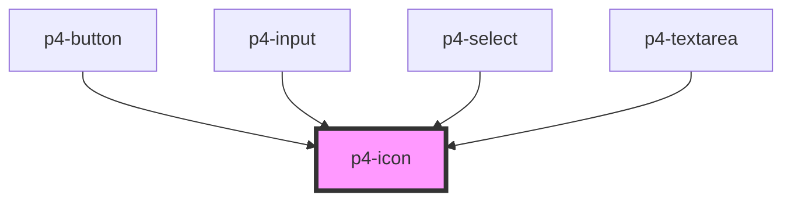

# p4-icon

<!-- Auto Generated Below -->

## Properties

| Property | Attribute | Description                                                                     | Type     | Default     |
| -------- | --------- | ------------------------------------------------------------------------------- | -------- | ----------- |
| `size`   | `size`    | The Icon size. Possible values are: `"sm"`, `"md"`, `"lg"`. Defaults to `"md"`. | `string` | `'md'`      |
| `type`   | `type`    |                                                                                 | `string` | `undefined` |

## Dependencies

### Used by

 - [p4-button](../p4-button)
 - [p4-input](../p4-input)
 - [p4-select](../p4-select)
 - [p4-textarea](../p4-textarea)

### Graph

----------------------------------------------

*Built with love!*
