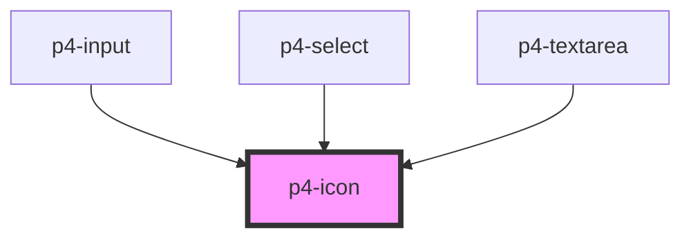

# p4-icon

<!-- Auto Generated Below -->

## Properties

| Property  | Attribute | Description                                                                                                                             | Type                                              | Default     |
| --------- | --------- | --------------------------------------------------------------------------------------------------------------------------------------- | ------------------------------------------------- | ----------- |
| `size`    | `size`    | The Icon size. Possible values are: `"sm"`, `"md"`, `"lg"`. Defaults to `"md"`.                                                         | `string`                                          | `'md'`      |
| `type`    | `type`    |                                                                                                                                         | `string`                                          | `'alarm'`   |
| `variant` | `variant` | Icon variants to add additional styling Possible values are `"default"`, `"primary"`, `"danger"`, `"success"`. Defaults to `"default"`. | `"danger" \| "default" \| "primary" \| "success"` | `'default'` |

## Dependencies

### Used by

 - [p4-input](../p4-input)
 - [p4-select](../p4-select)
 - [p4-textarea](../p4-textarea)

### Graph

----------------------------------------------

*Built with love!*
