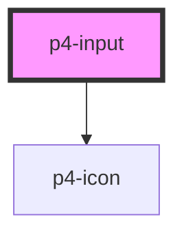

# p4-input

<!-- Auto Generated Below -->

## Properties

| Property       | Attribute      | Description                                                                                                                        | Type                                                   | Default                 |
| -------------- | -------------- | ---------------------------------------------------------------------------------------------------------------------------------- | ------------------------------------------------------ | ----------------------- |
| `actions`      | --             |                                                                                                                                    | `any[]`                                                | `[]`                    |
| `autocomplete` | `autocomplete` | Indicates whether the value of the control can be automatically completed by the browser.                                          | `"off" \| "on"`                                        | `'off'`                 |
| `clearInput`   | `clear-input`  | If `true`, a clear icon will appear in the input when there is a value. Clicking it clears the input.                              | `boolean`                                              | `false`                 |
| `debounce`     | `debounce`     | Set the amount of time, in milliseconds, to wait to trigger the `p4Change` event after each keystroke.                             | `number`                                               | `300`                   |
| `disabled`     | `disabled`     | If true, the user cannot interact with the button. Defaults to `false`.                                                            | `boolean`                                              | `false`                 |
| `name`         | `name`         | The input field name.                                                                                                              | `string`                                               | ``p4-input-${this.id}`` |
| `placeholder`  | `placeholder`  | The input field placeholder.                                                                                                       | `string`                                               | `undefined`             |
| `required`     | `required`     | If true, required icon is show. Defaults to `false`.                                                                               | `boolean`                                              | `false`                 |
| `size`         | `size`         | The input field size. Possible values are: `"sm"`, `"md"`, `"lg"`. Defaults to `"md"`.                                             | `"lg" \| "md" \| "sm"`                                 | `'md'`                  |
| `type`         | `type`         | The type of control to display. Possible values are: `"text"`, `"password"`, `"number"`, `"email"`, `"tel"`. Defaults to `"text"`. | `"email" \| "number" \| "password" \| "tel" \| "text"` | `'text'`                |
| `value`        | `value`        | The input field value.                                                                                                             | `number \| string`                                     | `''`                    |

## Events

| Event             | Description                                | Type               |
| ----------------- | ------------------------------------------ | ------------------ |
| `p4:action-click` | Emitted when the action button is clicked. | `CustomEvent<any>` |
| `p4:blur`         | Emitted when the input loses focus.        | `CustomEvent<any>` |
| `p4:change`       | Emitted when the value has changed.        | `CustomEvent<any>` |
| `p4:focus`        | Emitted when the input has focus.          | `CustomEvent<any>` |
| `p4:input`        | Emitted when a keyboard input occurred.    | `CustomEvent<any>` |

## Methods

### `setBlur() => Promise<void>`

Sets blur on the native `input` in `p4-input`. Use this method instead of the global
`input.blur()`.

#### Returns

Type: `Promise<void>`

### `setFocus() => Promise<void>`

Sets focus on the native `input` in `p4-input`. Use this method instead of the global
`input.focus()`.

#### Returns

Type: `Promise<void>`

## Dependencies

### Depends on

- [p4-icon](../p4-icon)

### Graph

----------------------------------------------

*Built with love!*
