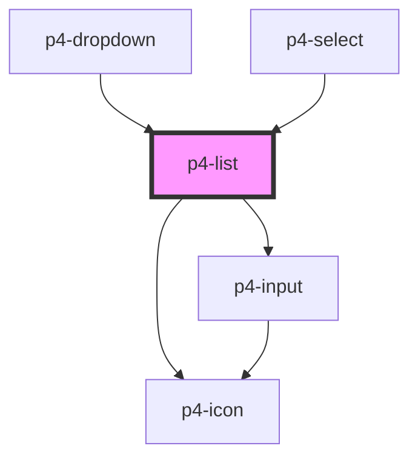

# p4-list

<!-- Auto Generated Below -->

## Properties

| Property       | Attribute       | Description | Type                                                                           | Default                                                                                       |
| -------------- | --------------- | ----------- | ------------------------------------------------------------------------------ | --------------------------------------------------------------------------------------------- |
| `data`         | --              |             | `any[]`                                                                        | `[]`                                                                                          |
| `emptyState`   | `empty-state`   |             | `any`                                                                          | `{     title: 'Empty List!',     message: 'There are no items to display at the moment',   }` |
| `enableSearch` | `enable-search` |             | `boolean`                                                                      | `false`                                                                                       |
| `itemVariant`  | `item-variant`  |             | `"caption" \| "default" \| "icon" \| "icon-caption" \| "img" \| "img-caption"` | `'default'`                                                                                   |
| `showLoader`   | `show-loader`   |             | `boolean`                                                                      | `false`                                                                                       |
| `value`        | `value`         |             | `number \| string`                                                             | `undefined`                                                                                   |
| `variant`      | `variant`       |             | `"default" \| "group"`                                                         | `'default'`                                                                                   |

## Events

| Event           | Description                       | Type               |
| --------------- | --------------------------------- | ------------------ |
| `p4:item-click` | Emitted when the item is clicked. | `CustomEvent<any>` |

## Methods

### `setFocus(previousItem?: boolean) => Promise<void>`

Sets focus on the first item of list.

#### Returns

Type: `Promise<void>`

## Dependencies

### Used by

 - [p4-dropdown](../p4-dropdown)
 - [p4-select](../p4-select)

### Depends on

- [p4-icon](../p4-icon)
- [p4-input](../p4-input)

### Graph

----------------------------------------------

*Built with love!*
