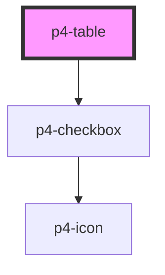

# p4-table

<!-- Auto Generated Below -->

## Properties

| Property          | Attribute        | Description                                                                                                                                                                                                                                   | Type         | Default     |
| ----------------- | ---------------- | --------------------------------------------------------------------------------------------------------------------------------------------------------------------------------------------------------------------------------------------- | ------------ | ----------- |
| `columns`         | --               | Grid columns configuration. [ {   "name":"name",   "label":"Name",   "width":300,   "fixed":true  }, {   "name":"age",   "label":"Age" } ]                                                                                                    | `any[]`      | `[]`        |
| `dataSource`      | --               | Grid data to display on table [{  'id': '5e7118ddce4b3d577956457f',  'age': 21,  'name': 'John',  'company': 'India',  'email': 'john@example.com',  'phone': '+1 (839) 560-3581',  'address': '326 Irving Street, Grimsley, Texas, 4048'  }] | `any[]`      | `[]`        |
| `keyField`        | `key-field`      |                                                                                                                                                                                                                                               | `string`     | `'id'`      |
| `selectedRowKeys` | --               |                                                                                                                                                                                                                                               | `string[]`   | `[]`        |
| `selectionType`   | `selection-type` |                                                                                                                                                                                                                                               | `"checkbox"` | `undefined` |

## Events

| Event                    | Description | Type               |
| ------------------------ | ----------- | ------------------ |
| `p4:table-cell-click`    |             | `CustomEvent<any>` |
| `p4:table-select-change` |             | `CustomEvent<any>` |

## Dependencies

### Depends on

- [p4-checkbox](../p4-checkbox)

### Graph

----------------------------------------------

*Built with love!*
