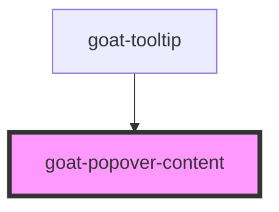

# goat-dropdown

<!-- Auto Generated Below -->

## CSS Custom Properties

| Name                              | Description                             |
| --------------------------------- | --------------------------------------- |
| `--goat-menu-shadow`              | Shadow of popover content               |
| `--popover-content-background`    | Background color of the popover content |
| `--popover-content-border-radius` | Border radius of the popover content    |
| `--popover-padding`               | Padding of the popover content          |

## Dependencies

### Used by

 - [goat-tooltip](../../tooltip)

### Graph

----------------------------------------------

*Built with love!*
