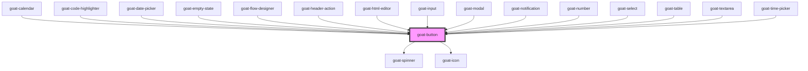

# goat-button

<!-- Auto Generated Below -->

## Properties

| Property         | Attribute         | Description                                                                                                                                                                                              | Type                                                                                   | Default     |
| ---------------- | ----------------- | -------------------------------------------------------------------------------------------------------------------------------------------------------------------------------------------------------- | -------------------------------------------------------------------------------------- | ----------- |
| `color`          | `color`           | Button color. Possible values are `"primary"`, `"secondary"`, `"success"`, `"danger"`, `"white"`. Defaults to `"primary"`.                                                                               | `"black" \| "danger" \| "primary" \| "secondary" \| "success" \| "warning" \| "white"` | `'primary'` |
| `configAria`     | `config-aria`     |                                                                                                                                                                                                          | `any`                                                                                  | `{}`        |
| `darkModeColor`  | `dark-mode-color` | Button color in dark mode. Possible values are `"primary"`, `"secondary"`, `"success"`, `"danger"`, `"white"`.                                                                                           | `"black" \| "danger" \| "primary" \| "secondary" \| "success" \| "warning" \| "white"` | `undefined` |
| `disabled`       | `disabled`        | If true, the user cannot interact with the button. Defaults to `false`.                                                                                                                                  | `boolean`                                                                              | `false`     |
| `disabledReason` | `disabled-reason` | If button is disabled, the reason why it is disabled.                                                                                                                                                    | `string`                                                                               | `''`        |
| `href`           | `href`            | Hyperlink to navigate to on click.                                                                                                                                                                       | `string`                                                                               | `undefined` |
| `icon`           | `icon`            | Icon which will displayed on button. Possible values are icon names.                                                                                                                                     | `string`                                                                               | `undefined` |
| `iconAlign`      | `icon-align`      | Icon alignment. Possible values are `"start"`, `"end"`. Defaults to `"end"`.                                                                                                                             | `"end" \| "start"`                                                                     | `'end'`     |
| `iconSize`       | `icon-size`       | Icon size. Possible values are `"sm"`, `"md"`, `"lg"`. Defaults to `"md"`.                                                                                                                               | `string`                                                                               | `'md'`      |
| `kind`           | `kind`            | Button kind. Possible values are `"default"`, `"simple"`, `"block"`. Defaults to `"default"`. `"default"` is a long button. `"simple"` is a text-only button. `"block"` is a full-width button.          | `"block" \| "default" \| "simple"`                                                     | `'default'` |
| `selected`       | `selected`        | Button selection state.                                                                                                                                                                                  | `boolean`                                                                              | `false`     |
| `showLoader`     | `show-loader`     | If true, a loader will be displayed on button.                                                                                                                                                           | `boolean`                                                                              | `false`     |
| `size`           | `size`            | Button size. Possible values are `"sm"`, `"md"`, `"lg"`, `"xl"`, `"2xl"`, `"full"`. Defaults to `"md"`.                                                                                                  | `"2xl" \| "lg" \| "md" \| "sm" \| "xl"`                                                | `'md'`      |
| `target`         | `target`          | Sets or retrieves the window or frame at which to target content.                                                                                                                                        | `string`                                                                               | `'_self'`   |
| `type`           | `type`            | Button type. Possible values are `"button"`, `"submit"`, `"reset"`. Defaults to `"button"`.                                                                                                              | `"button" \| "reset" \| "submit"`                                                      | `'button'`  |
| `variant`        | `variant`         | Button variants. Possible values are `"default"`, `"outline"`, `"ghost"`. Defaults to `"default"`. `"default"` is a filled button. `"outline"` is an outlined button. `"ghost"` is a transparent button. | `"default" \| "ghost" \| "light" \| "link" \| "outline"`                               | `'default'` |

## Events

| Event                | Description                                                               | Type               |
| -------------------- | ------------------------------------------------------------------------- | ------------------ |
| `goat-button--click` | On click of button, a CustomEvent 'goat-button--click' will be triggered. | `CustomEvent<any>` |

## Methods

### `setBlur() => Promise<void>`

Sets blur on the native `button` in `goat-button`. Use this method instead of the global
`button.blur()`.

#### Returns

Type: `Promise<void>`

### `setFocus() => Promise<void>`

Sets focus on the native `button` in `goat-button`. Use this method instead of the global
`button.focus()`.

#### Returns

Type: `Promise<void>`

### `triggerClick() => Promise<void>`

Triggers a click event on the native `button` in `goat-button`. Use this method instead of the global
`button.click()`.

#### Returns

Type: `Promise<void>`

## CSS Custom Properties

| Name                                   | Description                                                                                              |
| -------------------------------------- | -------------------------------------------------------------------------------------------------------- |
| `--goat-button-border-radius`          | Button border radius.                                                                                    |
| `--goat-button-border-style`           | Button border style.                                                                                     |
| `--goat-button-color`                  | Button filling color.                                                                                    |
| `--goat-button-color-active`           | Button filling color on active.                                                                          |
| `--goat-button-color-hover`            | Button filling color on hover.                                                                           |
| `--goat-button-color-light`            | Button filling color for light variant.                                                                  |
| `--goat-button-padding`                | Button padding.                                                                                          |
| `--goat-button-support-contrast-color` | Button support color (text or border). Should be white or black based on weight of button filling color. |
| `--goat-theme-button-border-radius`    | Theme level button border radius. (applies to all buttons)                                               |
| `--goat-theme-button-border-style`     | Theme level button border style. (applies to all buttons)                                                |

## Dependencies

### Used by

 - [goat-calendar](../../../application/calendar/calendar)
 - [goat-code-highlighter](../../../application/code-highlighter)
 - [goat-date-picker](../../../input-controls/data-and-time/date/date-picker)
 - [goat-empty-state](../../../application/empty-state)
 - [goat-flow-designer](../../../application/flow-designer/flow-designer)
 - [goat-header-action](../../../application/header/header-action)
 - [goat-html-editor](../../../input-controls/html-editor)
 - [goat-input](../../../input-controls/input/input)
 - [goat-modal](../../../informational/modal/modal)
 - [goat-notification](../../../informational/notification)
 - [goat-number](../../../input-controls/input/number)
 - [goat-select](../../../input-controls/select)
 - [goat-table](../../../table)
 - [goat-textarea](../../../input-controls/input/textarea)
 - [goat-time-picker](../../../input-controls/data-and-time/date/time-picker)

### Depends on

- [goat-spinner](../../../informational/spinner)
- [goat-icon](../../icon)

### Graph

----------------------------------------------

*Built with love!*
