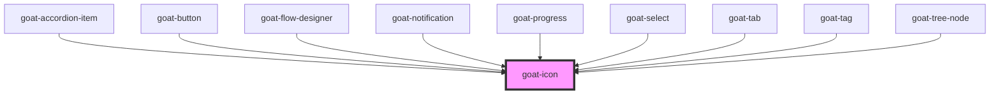

# goat-icon

<!-- Auto Generated Below -->

## Properties

| Property | Attribute | Description                                                                                                                                                                                                                  | Type     | Default     |
| -------- | --------- | ---------------------------------------------------------------------------------------------------------------------------------------------------------------------------------------------------------------------------- | -------- | ----------- |
| `name`   | `name`    | The identifier for the icon. This name corresponds to a specific SVG asset in the icon set.                                                                                                                                  | `string` | `undefined` |
| `size`   | `size`    | The size of the icon. This can be specified in pixels (px) or rem units to control the icon's dimensions. If a number is provided, it will be treated as rem units. For example, '16px', '2rem', or 2 would be valid values. | `string` | `undefined` |

## Dependencies

### Used by

 - [goat-accordion-item](../../containers/accordion/accordion-item)
 - [goat-button](../button/button)
 - [goat-flow-designer](../../application/flow-designer/flow-designer)
 - [goat-notification](../../informational/notification)
 - [goat-progress](../../informational/progress)
 - [goat-select](../../input-controls/select)
 - [goat-tab](../../navigation/tabs/tab)
 - [goat-tag](../tag)
 - [goat-tree-node](../../navigation/tree-view/tree-node)

### Graph

----------------------------------------------

*Built with love!*
