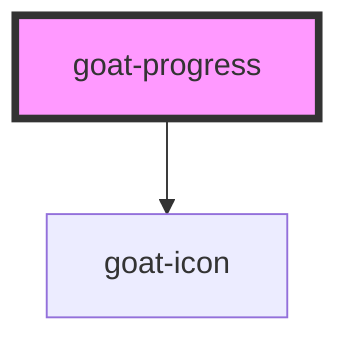

# goat-spinner

<!-- Auto Generated Below -->

## Properties

| Property     | Attribute     | Description                                                           | Type                               | Default     |
| ------------ | ------------- | --------------------------------------------------------------------- | ---------------------------------- | ----------- |
| `helperText` | `helper-text` |                                                                       | `string`                           | `undefined` |
| `hideLabel`  | `hide-label`  |                                                                       | `boolean`                          | `false`     |
| `label`      | `label`       | A label describing the progress bar.                                  | `string`                           | `undefined` |
| `size`       | `size`        |  Possible values are: `"sm"` and `"md"` in pixel. Defaults to `"md"`. | `"md" \| "sm"`                     | `'md'`      |
| `status`     | `status`      |                                                                       | `"active" \| "error" \| "success"` | `'active'`  |
| `value`      | `value`       |                                                                       | `number`                           | `null`      |

## Dependencies

### Depends on

- [goat-icon](../icon)

### Graph

----------------------------------------------

*Built with love!*
