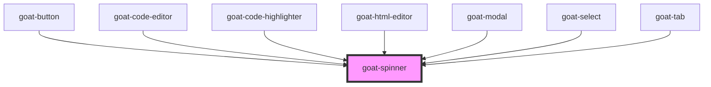

# goat-spinner

<!-- Auto Generated Below -->

## Properties

| Property         | Attribute         | Description                                                                                       | Type      | Default        |
| ---------------- | ----------------- | ------------------------------------------------------------------------------------------------- | --------- | -------------- |
| `description`    | `description`     |                                                                                                   | `string`  | `'Loading...'` |
| `hideBackground` | `hide-background` |                                                                                                   | `boolean` | `false`        |
| `size`           | `size`            | The Icon size. Possible values are: `"sm"`, `"md"`, `"lg"` and size in pixel. Defaults to `"md"`. | `string`  | `'md'`         |

## Dependencies

### Used by

 - [goat-button](../primitive/button/button)
 - [goat-code-editor](../input-controls/code-editor)
 - [goat-code-highlighter](../application/code-highlighter)
 - [goat-html-editor](../input-controls/html-editor)
 - [goat-modal](../informational/modal/modal)
 - [goat-select](../input-controls/select)
 - [goat-tab](../navigation/tabs/tab)

### Graph

----------------------------------------------

*Built with love!*
