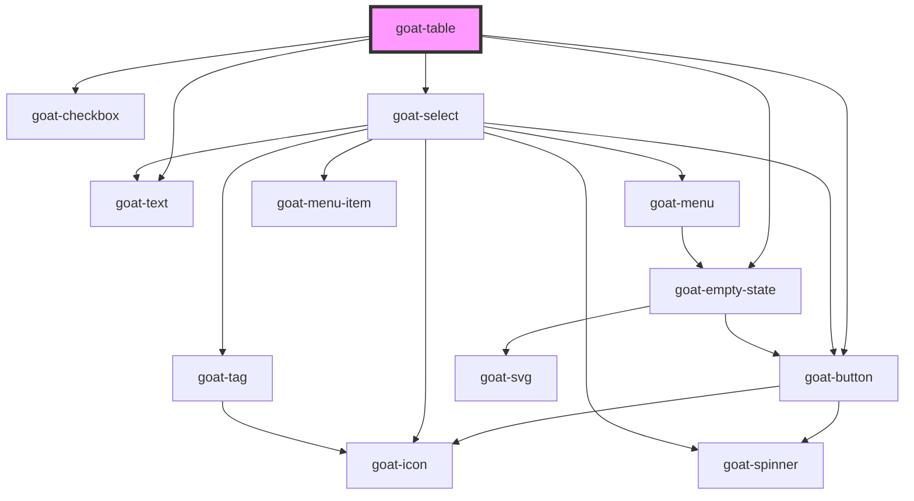

# goat-table

<!-- Auto Generated Below -->

## Properties

| Property                | Attribute                 | Description                                                                                                                                                                                                                                   | Type                           | Default                           |
| ----------------------- | ------------------------- | --------------------------------------------------------------------------------------------------------------------------------------------------------------------------------------------------------------------------------------------- | ------------------------------ | --------------------------------- |
| `columns`               | --                        | Grid columns configuration. [ {   "name":"name",   "label":"Name",   "width":300,   "fixed":true,   "template": function(row, column) { return row[column.name];}  }, {   "name":"age",   "label":"Age" } ]                                   | `any[]`                        | `[]`                              |
| `data`                  | --                        | Grid data to display on table [{  'id': '5e7118ddce4b3d577956457f',  'age': 21,  'name': 'John',  'company': 'India',  'email': 'john@example.com',  'phone': '+1 (839) 560-3581',  'address': '326 Irving Street, Grimsley, Texas, 4048'  }] | `any[]`                        | `[]`                              |
| `emptyStateDescription` | `empty-state-description` |                                                                                                                                                                                                                                               | `string`                       | `'There are no items to display'` |
| `emptyStateHeadline`    | `empty-state-headline`    |                                                                                                                                                                                                                                               | `string`                       | `'No items'`                      |
| `keyField`              | `key-field`               |                                                                                                                                                                                                                                               | `string`                       | `'id'`                            |
| `layer`                 | `layer`                   |                                                                                                                                                                                                                                               | `"01" \| "02" \| "background"` | `undefined`                       |
| `managed`               | `managed`                 |                                                                                                                                                                                                                                               | `boolean`                      | `false`                           |
| `page`                  | `page`                    |                                                                                                                                                                                                                                               | `number`                       | `1`                               |
| `pageSize`              | `page-size`               |                                                                                                                                                                                                                                               | `number`                       | `10`                              |
| `paginate`              | `paginate`                |                                                                                                                                                                                                                                               | `boolean`                      | `true`                            |
| `selectedRowKeys`       | --                        |                                                                                                                                                                                                                                               | `string[]`                     | `[]`                              |
| `selectionType`         | `selection-type`          |                                                                                                                                                                                                                                               | `"checkbox"`                   | `undefined`                       |
| `sortBy`                | `sort-by`                 |                                                                                                                                                                                                                                               | `string`                       | `undefined`                       |
| `sortOrder`             | `sort-order`              |                                                                                                                                                                                                                                               | `"asc" \| "desc"`              | `'asc'`                           |
| `sortable`              | `sortable`                |                                                                                                                                                                                                                                               | `boolean`                      | `true`                            |
| `totalItems`            | `total-items`             |                                                                                                                                                                                                                                               | `any`                          | `undefined`                       |

## Events

| Event                          | Description                           | Type               |
| ------------------------------ | ------------------------------------- | ------------------ |
| `goat-table--cell-click`       | Emitted when a table cell is clicked. | `CustomEvent<any>` |
| `goat-table--page`             | Emitted when the page changes.        | `CustomEvent<any>` |
| `goat-table--selection-change` | Emitted when the selection changes.   | `CustomEvent<any>` |
| `goat-table--sort`             | Emitted when the table is sorted.     | `CustomEvent<any>` |

## Dependencies

### Depends on

- [goat-checkbox](../input-controls/checkbox)
- [goat-button](../primitive/button/button)
- [goat-select](../input-controls/select)
- [goat-text](../primitive/typography/text)
- [goat-empty-state](../application/empty-state)

### Graph

----------------------------------------------

*Built with love!*
