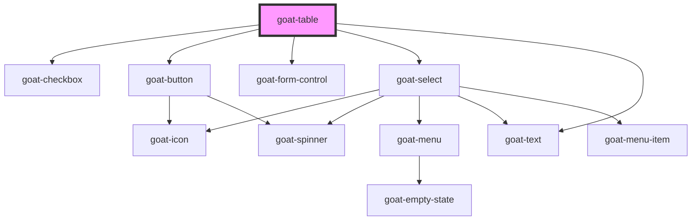

# goat-table

<!-- Auto Generated Below -->

## Properties

| Property          | Attribute        | Description                                                                                                                                                                                                                                   | Type              | Default     |
| ----------------- | ---------------- | --------------------------------------------------------------------------------------------------------------------------------------------------------------------------------------------------------------------------------------------- | ----------------- | ----------- |
| `columns`         | --               | Grid columns configuration. [ {   "name":"name",   "label":"Name",   "width":300,   "fixed":true  }, {   "name":"age",   "label":"Age" } ]                                                                                                    | `any[]`           | `[]`        |
| `data`            | --               | Grid data to display on table [{  'id': '5e7118ddce4b3d577956457f',  'age': 21,  'name': 'John',  'company': 'India',  'email': 'john@example.com',  'phone': '+1 (839) 560-3581',  'address': '326 Irving Street, Grimsley, Texas, 4048'  }] | `any[]`           | `[]`        |
| `keyField`        | `key-field`      |                                                                                                                                                                                                                                               | `string`          | `'id'`      |
| `managed`         | `managed`        |                                                                                                                                                                                                                                               | `boolean`         | `false`     |
| `page`            | `page`           |                                                                                                                                                                                                                                               | `number`          | `1`         |
| `pageSize`        | `page-size`      |                                                                                                                                                                                                                                               | `number`          | `10`        |
| `paginate`        | `paginate`       |                                                                                                                                                                                                                                               | `boolean`         | `true`      |
| `selectedRowKeys` | --               |                                                                                                                                                                                                                                               | `string[]`        | `[]`        |
| `selectionType`   | `selection-type` |                                                                                                                                                                                                                                               | `"checkbox"`      | `undefined` |
| `sortBy`          | `sort-by`        |                                                                                                                                                                                                                                               | `string`          | `undefined` |
| `sortOrder`       | `sort-order`     |                                                                                                                                                                                                                                               | `"asc" \| "desc"` | `'asc'`     |
| `sortable`        | `sortable`       |                                                                                                                                                                                                                                               | `boolean`         | `true`      |
| `totalItems`      | `total-items`    |                                                                                                                                                                                                                                               | `any`             | `undefined` |

## Events

| Event                      | Description | Type               |
| -------------------------- | ----------- | ------------------ |
| `goat:page`                |             | `CustomEvent<any>` |
| `goat:sort`                |             | `CustomEvent<any>` |
| `goat:table-cell-click`    |             | `CustomEvent<any>` |
| `goat:table-select-change` |             | `CustomEvent<any>` |

## Dependencies

### Depends on

- [goat-checkbox](../../form/checkbox)
- [goat-button](../../form/button)
- [goat-form-control](../../form/form-control)
- [goat-select](../../form/select)
- [goat-text](../../content/text)

### Graph

----------------------------------------------

*Built with love!*
