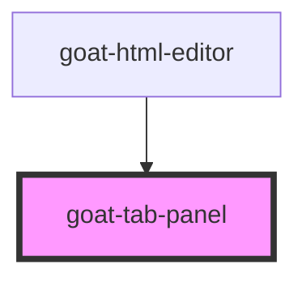

# goat-tab

<!-- Auto Generated Below -->

## Properties

| Property | Attribute | Description | Type      | Default     |
| -------- | --------- | ----------- | --------- | ----------- |
| `active` | `active`  |             | `boolean` | `false`     |
| `value`  | `value`   |             | `string`  | `undefined` |

## Dependencies

### Used by

 - [goat-html-editor](../../data-entry/html-editor)

### Graph

----------------------------------------------

*Built with love!*
