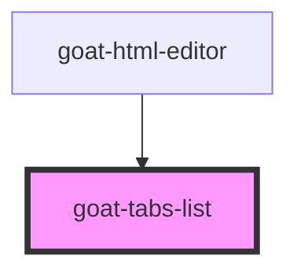

# goat-tabs

<!-- Auto Generated Below -->

## Properties

| Property  | Attribute | Description | Type                                             | Default     |
| --------- | --------- | ----------- | ------------------------------------------------ | ----------- |
| `managed` | `managed` |             | `boolean`                                        | `false`     |
| `type`    | `type`    |             | `"contained" \| "contained-bottom" \| "default"` | `'default'` |

## Dependencies

### Used by

 - [goat-html-editor](../../data-entry/html-editor)

### Graph

----------------------------------------------

*Built with love!*
