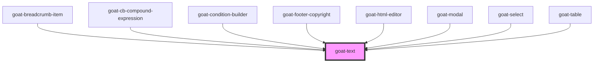

# goat-heading

<!-- Auto Generated Below -->

## Properties

| Property       | Attribute       | Description | Type                                                                                                                             | Default     |
| -------------- | --------------- | ----------- | -------------------------------------------------------------------------------------------------------------------------------- | ----------- |
| `color`        | `color`         |             | `"error" \| "helper" \| "inverse" \| "on-color" \| "primary" \| "secondary" \| "tertiary"`                                       | `'primary'` |
| `configAria`   | `config-aria`   |             | `any`                                                                                                                            | `{}`        |
| `expressive`   | `expressive`    |             | `boolean`                                                                                                                        | `false`     |
| `headingLevel` | `heading-level` |             | `1 \| 2 \| 3 \| 4 \| 5 \| 6`                                                                                                     | `undefined` |
| `headingSize`  | `heading-size`  |             | `1 \| 2 \| 3 \| 4 \| 5 \| 6 \| 7`                                                                                                | `7`         |
| `inline`       | `inline`        |             | `boolean`                                                                                                                        | `false`     |
| `type`         | `type`          |             | `"body" \| "body-compact" \| "code" \| "fluid-heading" \| "heading" \| "heading-compact" \| "helper-text" \| "label" \| "legal"` | `'body'`    |

## Dependencies

### Used by

 - [goat-breadcrumb-item](../breadcrumb/breadcrumb-item)
 - [goat-cb-compound-expression](../condition-builder/cb-compound-expression)
 - [goat-condition-builder](../condition-builder/condition-builder)
 - [goat-footer-copyright](../footer/footer-copyright)
 - [goat-html-editor](../data-entry/html-editor)
 - [goat-modal](../modal/modal)
 - [goat-select](../data-entry/select)
 - [goat-table](../table)

### Graph

----------------------------------------------

*Built with love!*
