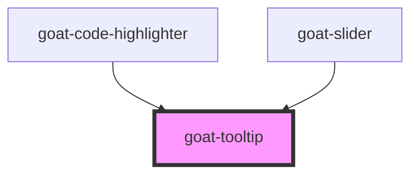

# goat-icon

<!-- Auto Generated Below -->

## Properties

| Property     | Attribute    | Description | Type      | Default                                                             |
| ------------ | ------------ | ----------- | --------- | ------------------------------------------------------------------- |
| `managed`    | `managed`    |             | `boolean` | `false`                                                             |
| `open`       | `open`       |             | `boolean` | `false`                                                             |
| `placements` | `placements` |             | `string`  | `'top,top-start,top-end,bottom,bottom-start,bottom-end,right,left'` |

## Dependencies

### Used by

 - [goat-code-highlighter](../code-highlighter)
 - [goat-slider](../data-entry/slider)

### Graph

----------------------------------------------

*Built with love!*
