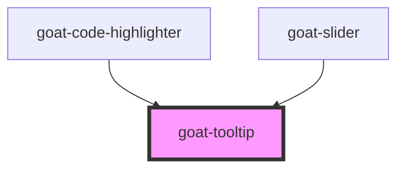

# goat-icon

<!-- Auto Generated Below -->

## Properties

| Property     | Attribute    | Description                                                                                                      | Type      | Default                                                             |
| ------------ | ------------ | ---------------------------------------------------------------------------------------------------------------- | --------- | ------------------------------------------------------------------- |
| `managed`    | `managed`    | If true, the tooltip will be managed by the parent component.                                                    | `boolean` | `false`                                                             |
| `open`       | `open`       | If true, the tooltip will be visible.                                                                            | `boolean` | `false`                                                             |
| `placements` | `placements` | The placements of the tooltip. It can be top, top-start, top-end, bottom, bottom-start, bottom-end, right, left. | `string`  | `'top,top-start,top-end,bottom,bottom-start,bottom-end,right,left'` |

## Methods

### `openTooltip(target: any) => Promise<void>`

#### Parameters

| Name     | Type  | Description |
| -------- | ----- | ----------- |
| `target` | `any` |             |

#### Returns

Type: `Promise<void>`

## Dependencies

### Used by

 - [goat-code-highlighter](../code-highlighter)
 - [goat-slider](../data-entry/slider)

### Graph

----------------------------------------------

*Built with love!*
