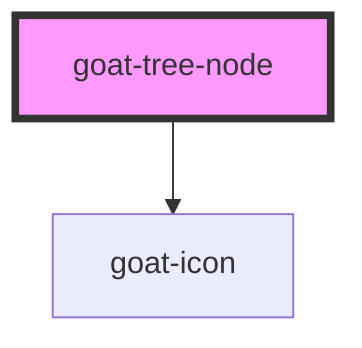

# goat-menu

<!-- Auto Generated Below -->

## Properties

| Property       | Attribute       | Description                                                             | Type               | Default     |
| -------------- | --------------- | ----------------------------------------------------------------------- | ------------------ | ----------- |
| `disabled`     | `disabled`      | If true, the user cannot interact with the button. Defaults to `false`. | `boolean`          | `false`     |
| `expanded`     | `expanded`      |                                                                         | `boolean`          | `true`      |
| `href`         | `href`          | Hyperlink to navigate to on click.                                      | `string`           | `undefined` |
| `label`        | `label`         |                                                                         | `string`           | `''`        |
| `level`        | `level`         |                                                                         | `number`           | `0`         |
| `selectedNode` | `selected-node` | Menu item selection state.                                              | `string`           | `undefined` |
| `value`        | `value`         | The menu item value.                                                    | `number \| string` | `undefined` |

## Events

| Event                  | Description                            | Type               |
| ---------------------- | -------------------------------------- | ------------------ |
| `goat:tree-node-click` | Emitted when the menu item is clicked. | `CustomEvent<any>` |

## Methods

### `setBlur() => Promise<void>`

Sets blur on the native `input` in `goat-input`. Use this method instead of the global
`input.blur()`.

#### Returns

Type: `Promise<void>`

### `setFocus() => Promise<void>`

Sets focus on the native `input` in `goat-input`. Use this method instead of the global
`input.focus()`.

#### Returns

Type: `Promise<void>`

## Dependencies

### Depends on

- [goat-icon](../../icon)

### Graph

----------------------------------------------

*Built with love!*
