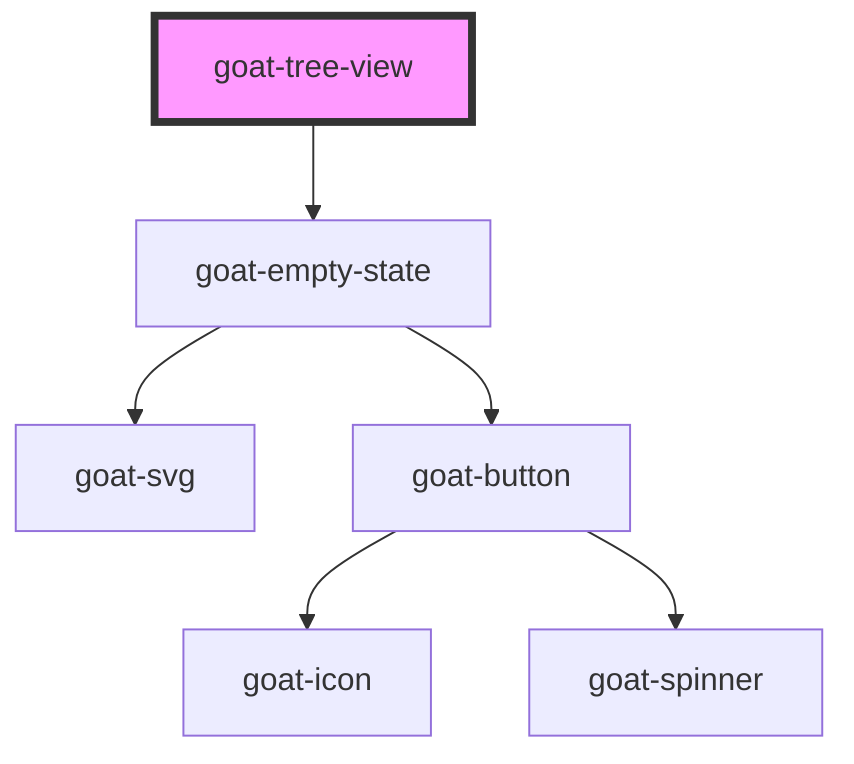

# goat-menu

<!-- Auto Generated Below -->

## Properties

| Property       | Attribute       | Description | Type      | Default                                                                                  |
| -------------- | --------------- | ----------- | --------- | ---------------------------------------------------------------------------------------- |
| `empty`        | `empty`         |             | `boolean` | `false`                                                                                  |
| `emptyState`   | `empty-state`   |             | `string`  | ``{     "headline": "No items",     "description": "There are no items to display"   }`` |
| `selectedNode` | `selected-node` |             | `string`  | `undefined`                                                                              |

## Methods

### `getSelectedNode() => Promise<string>`

#### Returns

Type: `Promise<string>`

### `setFocus() => Promise<void>`

Sets focus on first menu item. Use this method instead of the global
`element.focus()`.

#### Returns

Type: `Promise<void>`

### `subscribeToSelect(cb: any) => Promise<void>`

#### Parameters

| Name | Type  | Description |
| ---- | ----- | ----------- |
| `cb` | `any` |             |

#### Returns

Type: `Promise<void>`

## Dependencies

### Depends on

- [goat-empty-state](../../data-display/empty-state)

### Graph

----------------------------------------------

*Built with love!*
